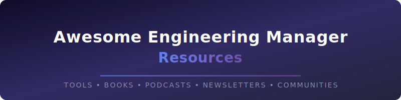

  

  <strong>A curated list of tools, templates, books, newsletters, podcasts, and resources for engineering managers and tech leaders.</strong>

  
  
  
  

  Whether you're a senior engineer preparing for your first management role or a seasoned EM looking to level up, this list has something for you.

---

> **Featured:** [AI Interview Coach](https://www.em-tools.io/ai-interview-coach) · [50+ Notion Templates for EMs](https://www.em-tools.io/templates) · [The EM's Field Guide](https://www.em-tools.io/field-guide) · [Blog for Engineering Managers](https://blog4ems.com/)

---

## Contents

- [Interactive Tools](#interactive-tools)
- [Templates & Frameworks](#templates--frameworks)
- [Books](#books)
- [Newsletters](#newsletters)
- [Podcasts](#podcasts)
- [Blogs & Writing](#blogs--writing)
- [Courses & Learning](#courses--learning)
- [Interview Prep](#interview-prep)
- [Communities](#communities)
- [Conferences](#conferences)
- [Contributing](#contributing)

---

## Interactive Tools

- [Engineering Manager ROI Calculator](https://www.em-tools.io/tools/roi-calculator) - Calculate the business impact of engineering initiatives to build better cases for resourcing.
- [RICE Prioritization Framework](https://www.em-tools.io/tools/rice-framework) - Interactive RICE scoring tool for prioritizing your backlog.
- [Focus Time Calculator](https://www.em-tools.io/tools/focus-time-calculator) - Estimate how much deep work time your team actually has after meetings.
- [Database Selector Tool](https://www.em-tools.io/tools/database-selector) - Compare databases side-by-side based on your requirements.
- [System Design Scenario Generator](https://www.em-tools.io/tools/system-design-generator) - Generate realistic system design scenarios for interviews and team exercises.
- [Engineering Manager vs Tech Lead Quiz](https://www.em-tools.io/tools/em-vs-tech-lead) - Not sure which path is right for you? This quiz helps you think through it.
- [Jellyfish](https://jellyfish.co/) - Engineering management analytics platform.
- [Pluralsight Flow](https://www.pluralsight.com/product/flow) - Engineering analytics for team leads.
- [Swarmia](https://www.swarmia.com/) - Engineering effectiveness platform with DORA metrics.

(<a href="#contents">back to top</a>)

## Templates & Frameworks

### Notion Templates

- [50+ Engineering Manager Notion Templates](https://www.em-tools.io/templates) - Templates for 1:1s, performance reviews, team charters, sprint retros, OKRs, hiring scorecards, onboarding plans, and more.
- [Notion Engineering Wiki Template](https://www.notion.so/templates/engineering-wiki) - Notion's official engineering wiki template.
- [Engineering Team Hub](https://www.notion.so/templates/category/engineering) - Notion's engineering template gallery.

### Frameworks & Models

- [DORA Metrics](https://dora.dev/) - The four key metrics for measuring engineering team performance.
- [Team Topologies](https://teamtopologies.com/) - Framework for organizing business and technology teams.
- [Westrum Organizational Culture](https://cloud.google.com/architecture/devops/devops-culture-westrum-organizational-culture) - Google's research on high-performing team cultures.
- [The Spotify Model](https://www.atlassian.com/agile/agile-at-scale/spotify) - Squads, tribes, chapters, and guilds.
- [Shape Up](https://basecamp.com/shapeup) - Basecamp's product development methodology.
- [Engineering Ladders](https://www.engineeringladders.com/) - Framework for engineering career ladders and competency matrices.
- [progression.fyi](https://progression.fyi/) - Collection of publicly available engineering career frameworks from real companies.

(<a href="#contents">back to top</a>)

## Books

### Essential Reading

- [The Manager's Path](https://www.oreilly.com/library/view/the-managers-path/9781491973882/) by Camille Fournier - The definitive guide to engineering management, from tech lead to CTO.
- [An Elegant Puzzle](https://press.stripe.com/an-elegant-puzzle) by Will Larson - Systems of engineering management.
- [Radical Candor](https://www.radicalcandor.com/) by Kim Scott - Care personally, challenge directly.
- [The Making of a Manager](https://www.juliezhuo.com/book/manager.html) by Julie Zhuo - What to do when everyone looks to you.
- [High Output Management](https://www.penguinrandomhouse.com/books/72467/high-output-management-by-andrew-s-grove/) by Andy Grove - The classic on management leverage.

### On Leadership & Culture

- [Turn the Ship Around!](https://davidmarquet.com/turn-the-ship-around-book/) by L. David Marquet - Intent-based leadership.
- [The Five Dysfunctions of a Team](https://www.tablegroup.com/product/dysfunctions/) by Patrick Lencioni - Understanding team dynamics.
- [No Rules Rules](https://www.norulesrules.com/) by Reed Hastings & Erin Meyer - Netflix's culture of freedom and responsibility.

### On Technical Leadership

- [Staff Engineer](https://staffeng.com/book) by Will Larson - Leadership beyond the management track.
- [The Phoenix Project](https://itrevolution.com/product/the-phoenix-project/) by Gene Kim - DevOps principles in novel form.
- [Accelerate](https://itrevolution.com/product/accelerate/) by Nicole Forsgren, Jez Humble & Gene Kim - The science behind DevOps and high performance.
- [Thinking in Systems](https://www.chelseagreen.com/product/thinking-in-systems/) by Donella Meadows - Essential for understanding complex engineering organizations.

### On Hiring & Growing People

- [Who](https://whothebook.com/) by Geoff Smart & Randy Street - The A Method for hiring.
- [The Coaching Habit](https://boxofcrayons.com/the-coaching-habit-book/) by Michael Bungay Stanier - Seven essential coaching questions.
- [Thanks for the Feedback](https://www.penguinrandomhouse.com/books/313485/thanks-for-the-feedback-by-douglas-stone-and-sheila-heen/) by Douglas Stone & Sheila Heen - The science and art of receiving feedback.

(<a href="#contents">back to top</a>)

## Newsletters

- [Blog for Engineering Managers](https://blog4ems.com/) - Weekly practical advice for Engineering Managers covering 1:1s, performance reviews, team building, and the IC-to-manager transition.
- [The Pragmatic Engineer](https://newsletter.pragmaticengineer.com/) by Gergely Orosz - Deep dives into engineering culture, career growth, and industry trends.
- [Lenny's Newsletter](https://www.lennysnewsletter.com/) by Lenny Rachitsky - Product management and growth, highly relevant for EMs working closely with product.
- [Engineering Leadership](https://newsletter.eng-leadership.com/) by Gregor Ojstersek - Practical engineering leadership insights.
- [The Engineering Manager](https://theengineeringmanager.substack.com/) by James Stanier - Weekly tips on engineering management.
- [LeadDev](https://leaddev.com/newsletter) - Engineering leadership articles, talks, and community.
- [Software Lead Weekly](https://softwareleadweekly.com/) - Curated links for busy engineering leaders.
- [Level Up](https://levelup.patkua.com/) by Pat Kua - Leadership tips for tech leads and engineering managers.
- [TLDR](https://tldr.tech/) - Daily tech newsletter (not EM-specific, but great for staying current).

(<a href="#contents">back to top</a>)

## Podcasts

- [Engineering Enablement](https://getdx.com/engineering-enablement-podcast/) - Developer experience and engineering effectiveness.
- [Soft Skills Engineering](https://softskills.audio/) - Weekly advice on non-technical challenges in tech.
- [The Changelog](https://changelog.com/podcast) - Conversations with the hackers, leaders, and innovators of open source.
- [Software Engineering Daily](https://softwareengineeringdaily.com/) - Technical interviews on architecture, infrastructure, and more.

(<a href="#contents">back to top</a>)

## Blogs & Writing

- [Blog for Engineering Managers](https://blog4ems.com/) - Weekly practical advice for EMs covering 1:1s, performance reviews, team building, and the IC-to-manager transition.
- [Will Larson's Blog](https://lethain.com/) - Deep writing on engineering management, systems thinking, and organizational design.
- [Charity Majors' Blog](https://charity.wtf/) - Observability, engineering culture, and management.
- [StaffEng](https://staffeng.com/) - Stories and guides for staff-plus engineers.
- [The Rands in Repose](https://randsinrepose.com/) by Michael Lopp - Classic engineering management writing.
- [Joel on Software](https://www.joelonsoftware.com/) by Joel Spolsky - Timeless essays on software, teams, and business.
- [Paul Graham's Essays](http://www.paulgraham.com/articles.html) - Startups, programming, and thinking clearly.
- [Dan Luu](https://danluu.com/) - Quantitative analysis of engineering and tech industry topics.
- [Julia Evans](https://jvns.ca/) - Making complex technical topics approachable (great for coaching your reports).
- [Jacob Kaplan-Moss](https://jacobian.org/) - Engineering management and leadership.

(<a href="#contents">back to top</a>)

## Courses & Learning

- [The EM's Field Guide](https://www.em-tools.io/field-guide) - Practical ebook covering the core skills every engineering manager needs, from running 1:1s to navigating reorgs.
- [Reforge](https://www.reforge.com/) - Growth, product, and leadership programs used by top tech companies.
- [Maven](https://maven.com/) - Cohort-based courses including several on engineering leadership.
- [O'Reilly Learning](https://www.oreilly.com/) - Extensive library of tech and management content.
- [LeadDev Together](https://leaddev.com/together) - Peer group learning for engineering managers.
- [Plato](https://www.platohq.com/) - Mentorship platform connecting engineering leaders.

(<a href="#contents">back to top</a>)

## Interview Prep

### Engineering Manager Interviews

- [AI Interview Coach for Engineering Managers](https://www.em-tools.io/ai-interview-coach) - AI-powered voice practice for EM behavioral interviews. Gives real-time feedback on STAR responses.
- [Get Hired as an Engineering Manager](https://www.em-tools.io/get-hired) - Complete interview prep bundle with question banks, answer frameworks, and strategies.
- [Exponent](https://www.tryexponent.com/) - Mock interviews and courses for PM and engineering roles.
- [IGotAnOffer](https://igotanoffer.com/) - Interview coaching and practice.
- [Hello Interview](https://www.hellointerview.com/) - System design and coding interview prep.

### Question Banks & Guides

- [Behavioral Interview Questions for EMs](https://www.techinterviewhandbook.org/) - Part of the broader Tech Interview Handbook.

(<a href="#contents">back to top</a>)

## Communities

- [Rands Leadership Slack](https://randsinrepose.com/welcome-to-rands-leadership-slack/) - 20,000+ engineering leaders. One of the most active communities for EMs.
- [LeadDev Community](https://leaddev.com/) - Articles, talks, and events for engineering leaders.
- [Engineering Managers Slack](https://engmanagers.github.io/) - Slack community focused on EM challenges.
- [CTO Craft](https://ctocraft.com/) - Community and events for CTOs and engineering leaders.
- [Hacker News](https://news.ycombinator.com/) - Not EM-specific, but essential reading for staying connected to what engineers care about.

(<a href="#contents">back to top</a>)

## Conferences

- [LeadDev](https://leaddev.com/events) - The premier conference for engineering leaders. Events in NYC, London, Berlin, and online.
- [WeAreDevelopers](https://www.wearedevelopers.com/) - Europe's largest dev conference with strong leadership tracks.
- [QCon](https://qconferences.com/) - Software development conferences with management tracks.
- [CTO Craft Con](https://conference.ctocraft.com/) - Conference focused on engineering leadership.
- [DevOpsDays](https://devopsdays.org/) - Community-organized conferences worldwide with strong leadership content.
- [StaffPlus](https://leaddev.com/staffplus) - By LeadDev, focused on staff+ engineers and technical leaders.

(<a href="#contents">back to top</a>)

---

## License

This list is released under CC0. You can copy, modify, and distribute it, even for commercial purposes, without asking permission.
